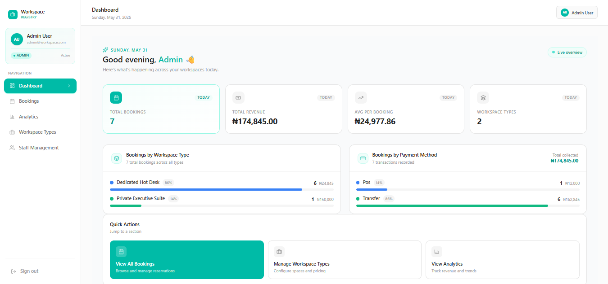
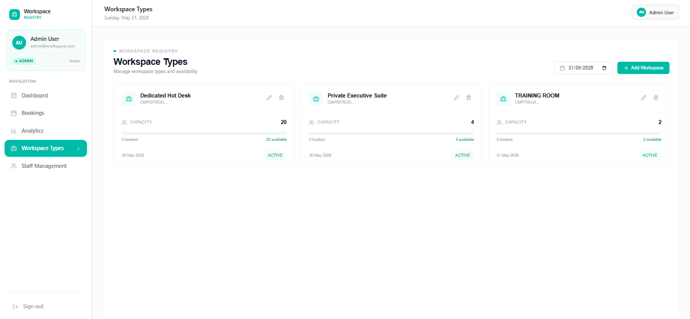
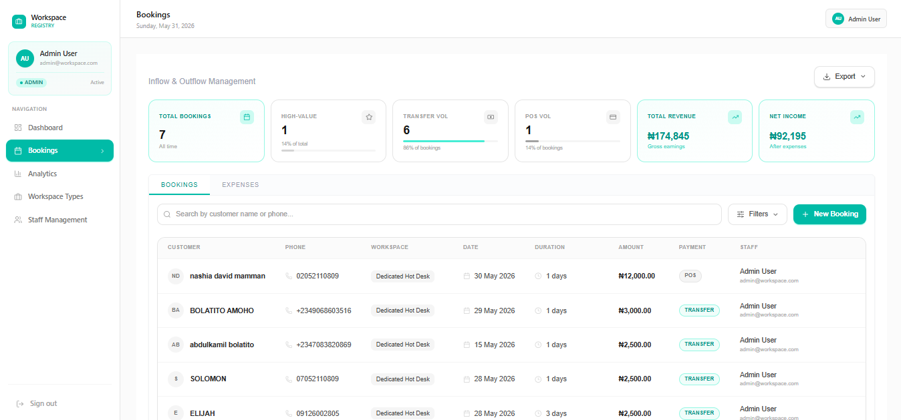
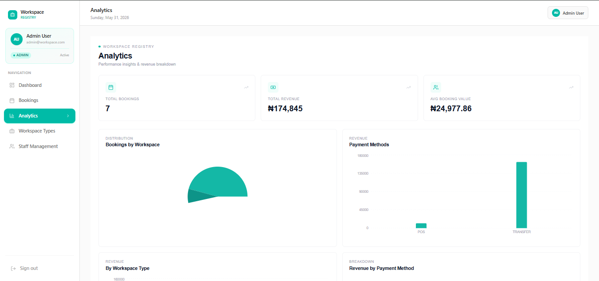
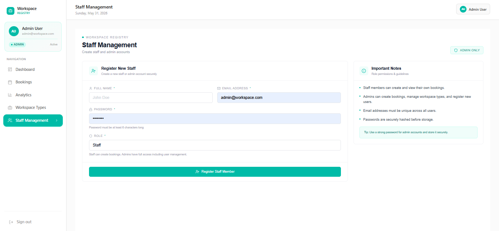

# Workspace Registry & Financial Management System

A modern workspace operations and financial management platform designed to help organizations track workspace bookings, monitor expenses, manage staff activities, and gain real-time visibility into business performance.

The system centralizes operational and financial workflows into a single dashboard, enabling administrators to manage bookings, workspace inventory, payment records, expenses, and analytics efficiently.

---

## 🚀 Features

### Workspace Management

* Workspace booking management
* Workspace type administration
* Booking creation and updates
* Customer and workspace allocation tracking

### Financial Management

* Revenue tracking from workspace bookings
* Expense management and categorization
* Financial inflow and outflow monitoring
* Payment method reporting

### Analytics & Reporting

* Real-time business metrics
* Revenue and expense summaries
* Workspace utilization insights
* Operational performance dashboards

### User Management

* Secure authentication
* Protected administrative routes
* Staff management
* Role-based access controls

### User Experience

* Responsive dashboard design
* Advanced filtering and search
* Real-time data updates
* Optimized data tables
* Mobile-friendly interface

---

## 📸 Screenshots

### Dashboard Overview

> Add screenshot here



---

### Workspace Bookings

> Add screenshot here



---

### Financial Management

> Add screenshot here



---

### Analytics Dashboard

> Add screenshot here



---

### Staff Management

> Add screenshot here



---

## 🛠️ Tech Stack

### Frontend

* React 18
* Vite
* JavaScript (ES6+)
* Tailwind CSS
* React Router
* Lucide React

### Backend Integration

* REST APIs
* JWT Authentication
* Axios

### Development Tools

* Git & GitHub
* ESLint
* Vercel
* Chrome Developer Tools

---

## 🏗️ Architecture Highlights

### Modular Component Design

The application is built using reusable and maintainable components, allowing features to be developed and updated independently without affecting other parts of the system.

### Custom State Management

A dedicated `useFinancials` hook manages financial operations, data synchronization, filtering logic, and state updates while keeping business logic separate from UI components.

### Optimized Data Handling

The platform processes complex booking and financial records while maintaining responsive user interactions through efficient filtering, searching, and rendering strategies.

### Defensive Data Processing

Backend responses are validated and normalized before rendering, ensuring the application remains stable even when handling incomplete or unexpected data structures.

---

## 📂 Project Structure

```text
src/
├── api/
├── auth/
├── components/
│   ├── dashboard/
│   ├── financials/
│   ├── Navbar.jsx
│   ├── Sidebar.jsx
│   └── ProtectedRoute.jsx
├── constants/
├── layouts/
├── pages/
│   ├── Dashboard.jsx
│   ├── Bookings.jsx
│   ├── Analytics.jsx
│   ├── StaffManagement.jsx
│   ├── WorkspaceTypes.jsx
│   └── Login.jsx
├── services/
├── App.jsx
└── main.jsx
```

---

## ⚙️ Getting Started

### Prerequisites

* Node.js 18+
* npm, yarn, or pnpm

### Clone the Repository

```bash
git clone https://github.com/bola02/workspace-registry-frontend.git
cd workspace-registry-frontend
```

### Install Dependencies

```bash
npm install
```

### Configure Environment Variables

Create a `.env` file in the root directory:

```env
VITE_API_URL=http://localhost:3000
```

### Start Development Server

```bash
npm run dev
```

Open:

```text
http://localhost:5173
```

---

## 🚀 Production Build

Generate a production build:

```bash
npm run build
```

Preview the production build locally:

```bash
npm run preview
```

---

## 📈 Key Engineering Decisions

* Implemented reusable dashboard and financial management components to improve maintainability.
* Utilized custom React hooks to separate business logic from presentation layers.
* Optimized rendering performance for large booking and financial datasets.
* Built flexible filtering and search capabilities for faster access to operational records.
* Designed responsive layouts that provide a consistent experience across desktop and mobile devices.

---

## 👨‍💻 Author

### Kameel Bolatito

Frontend Developer

GitHub: https://github.com/bola02

LinkedIn: https://linkedin.com/in/abdulkamil-bolatito

---

## 📄 License

This project is licensed under the MIT License.
